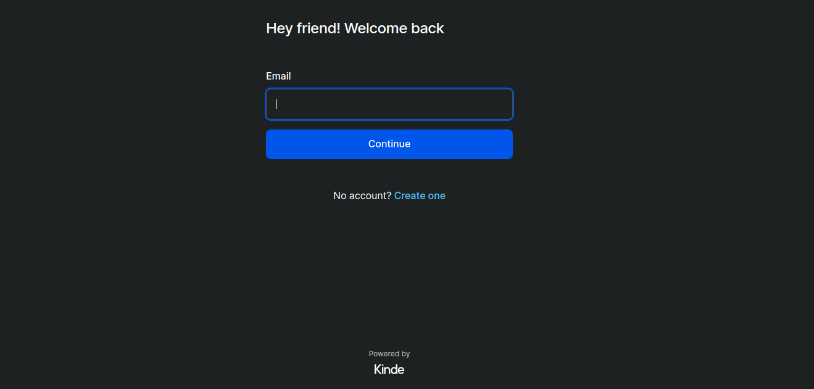
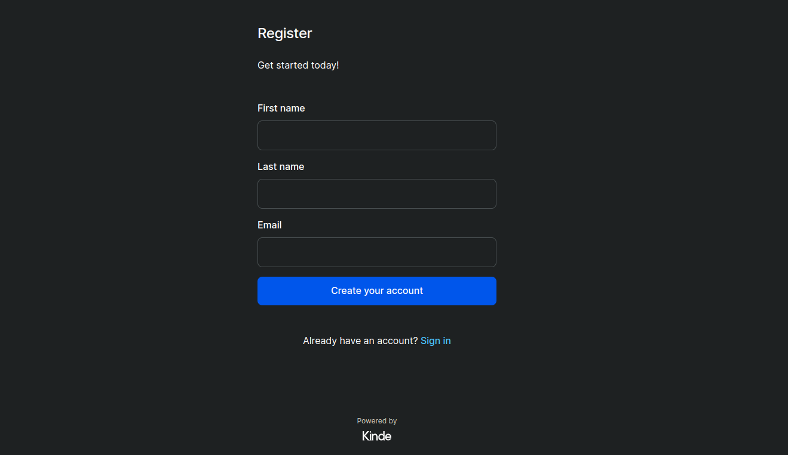
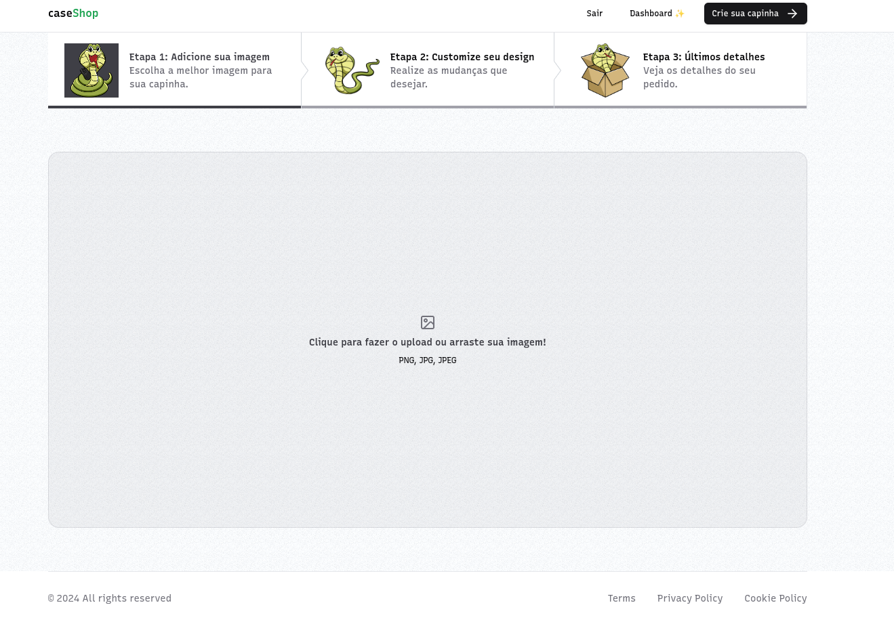
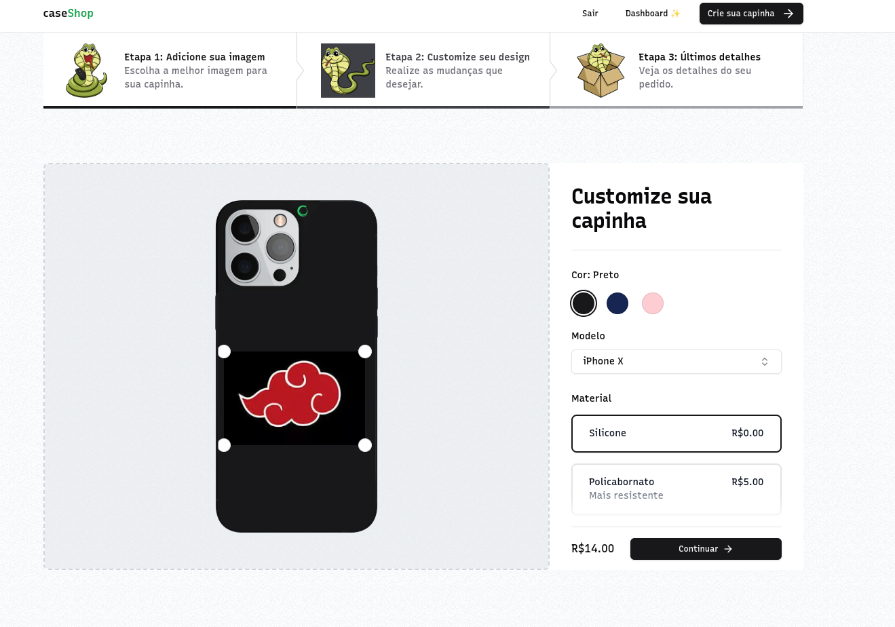
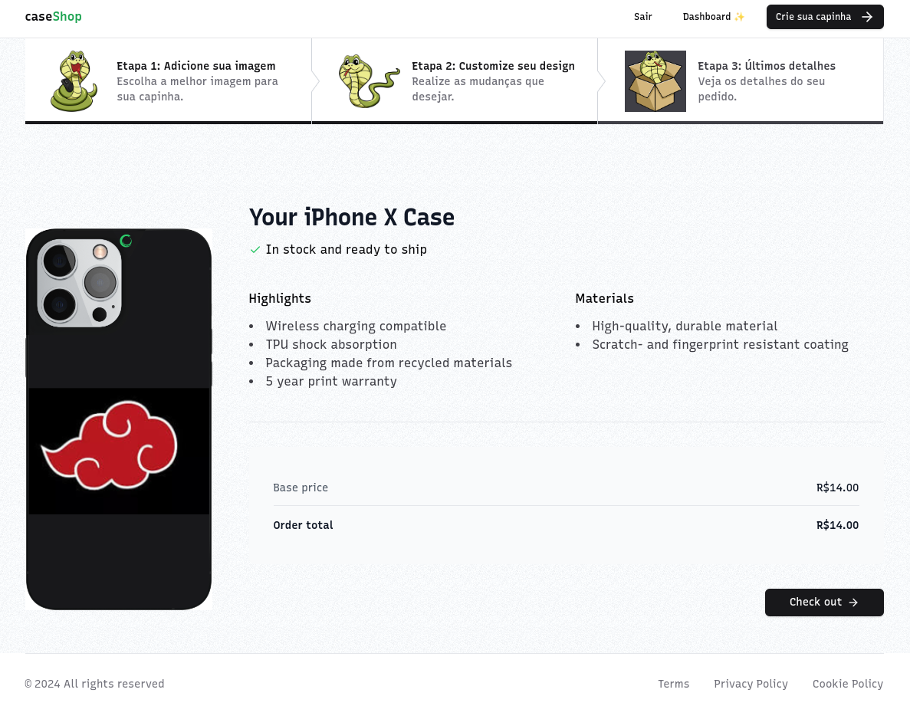

# Design of a website with customized cell phone cases.

## Technologies used in development

- [NextJs 14](https://nextjs.org/)
- [TailwindCSS](https://tailwindcss.com/)
- [Kinde](https://kinde.com/)
- [Shadcn/UI](https://ui.shadcn.com/)
- [Radix](https://www.radix-ui.com/)
- [Prisma](https://www.prisma.io/)
- [Zod](https://zod.dev/)
- [Uploadthing](https://uploadthing.com/)
- [Stripe](https://stripe.com/br)

## Features

- User performs the image upload (drag and drop or select file)
- User set the image crop on your case model
- Payment session with Stripe

## Presentention

### Home page

    
    
    
    

---

### Login and Register Page

    
    

---

### Upload image Page

    
    

---

### Preview Case Page

